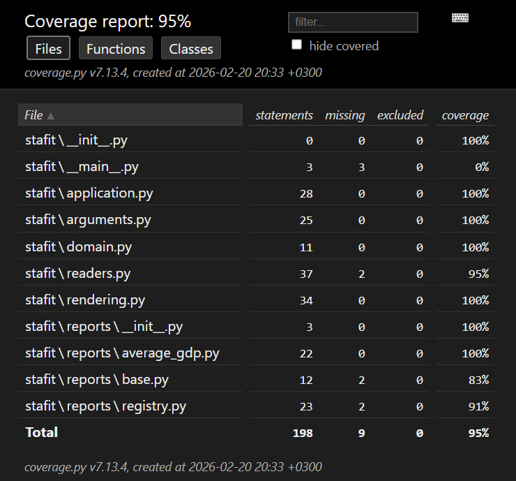

# StafIT test task

CLI-утилита для формирования отчетов по макроэкономическим CSV-файлам.
Сейчас реализован отчет `average-gdp`: считает среднее ВВП по странам по всем переданным файлам и сортирует результат по
убыванию.

## Установка

```bash
poetry install
```

## Запуск

```bash
poetry run python -m stafit --files examples/economic1.csv examples/economic2.csv --report average-gdp
```

## Тесты

```bash
poetry run pytest
```

## Как добавить новый отчет

1. Создайте новый класс отчета в `stafit/reports/` на основе `BaseReport`.
2. Реализуйте `name` и `build`.
3. Зарегистрируйте отчет в `ReportRegistry.with_default_reports()`.

## Скрины

### Примеры запуска


### Покрытие

